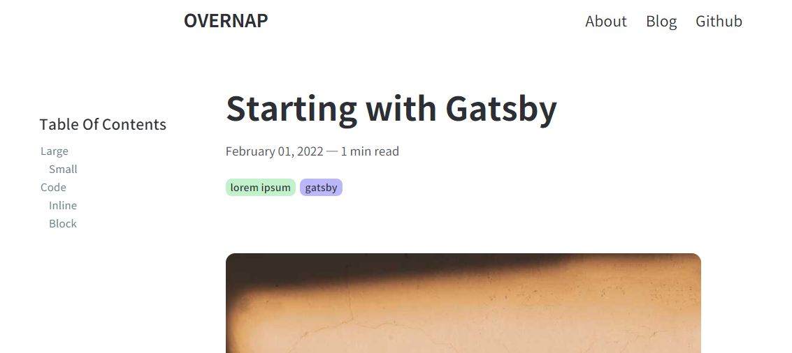

# gatsby-starter-clean

A simple starter for personal use.

Ready-to-use starter to make a blog.



## Features

- Typescript
- TOC
- Utterances
- Prism.js, Katex, and other annoying settings...

## How to use

Put your information in the `gatsby-config.js`.

Below is an example from mine.

```typescript
siteMetadata: {
    title: "OVERNAP", // blog title
    author: "Overnap", // for footer
    github: "Overnap", // for github link
    email: "overnapworks@gmail.com",
    description: "a blog of overnap",
    siteUrl: "https://overnap.com",
    repository: "Overnap/overnap.com", // for utterances
}
```

If you want to use google gtag, enter your tracking id in the same file.

```typescript
{
    resolve: "gatsby-plugin-google-gtag",
    options: {
    	trackingIds: ["YOUR_TRACKING_ID"],
    },
},
```

Blog posts are written in `content/post`.

To edit the landing page or about page, see `content/essentail`.

(Optional) If you are not a Korean, I recommend customizing fonts in `src/components/SEO.tsx`, `src/components/GlobalStyle.tsx`, and `static/font.css`.

## Reference

Written by referring to the repos below:

[gatsbyjs/gatsby-starter-hello-world](https://github.com/gatsbyjs/gatsby-starter-hello-world)

[LekoArts/gatsby-starter-minimal-blog](https://github.com/LekoArts/gatsby-starter-minimal-blog)

[apple12347678/blog.appleseed.dev](https://github.com/apple12347678/blog.appleseed.dev)
