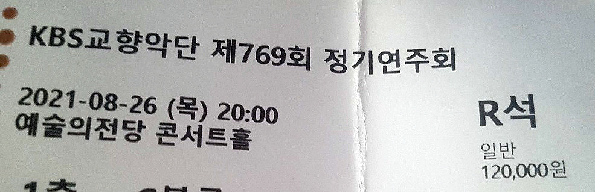

오랜만에 공연에 다녀왔다. 정명훈과 개릭 올슨이 함께한 KBS 공연이었다.

프로그램은 슈만 피아노 협주곡과 무소륵스키 전람회의 그림 라벨 편곡. 둘 다 좋아하는 곡이라 할인도 없이 R석 예매를 결심했다. 전람회의 그림은 무소륵스키 원곡과 라벨 편곡을 모두 좋아한다. 슈피협은 얼마 전 처음으로 듣고선 마음에 들어 수십 번을 반복한 곡이다.

지휘자와 협연자 둘 다 네임 밸류가 있는 사람들이다 보니 큰 기대를 했다. 하도 정명훈, 정명훈 하는데 지휘자 하나만으로 오케스트라의 퀄리티가 얼마나 바뀔 수 있는지 궁금하기도 했다.

사람들도 비슷하게 기대했나 보다. 홀에 입장하니 관객이 아주 많았다. 2좌석 앉고 1좌석 비우는 일명 퐁퐁당 좌석 공연이었는데도 홀이 꽉 찬 느낌이었다.

## 슈만 피아노 협주곡

개릭 올슨은 쇼콩 우승자 출신이라는 말만 들었지 따로 앨범이나 사진을 찾아보진 않았다. 이번 공연에서 처음으로 보았는데 체구가 커서 놀랐다. 그만큼 파워풀한 스타일이려나 생각했다.

의외로 연주는 침착한 스타일이었다. 나이가 있으신 걸 고려하더라도 강렬하기보단 섬세한 편. 슈만 작품은 정신없는 맛이라고 생각하는데, 슈피협의 감정 과잉이 부족해 내 취향의 해석은 아니었다.

처음으로 앞쪽 열에 앉아봤는데 협주곡에선 기피해야 할 자리 같다. 피아노 소리가 너무 커서 목관이나 금관이 묻힐 정도였다. 하지만 뒤쪽 열에선 잘 듣지 못했던, 피아노와 현악의 세세한 소리까지 들리는 건 재밌는 경험이었다. 협연자의 표정과 페달링을 자세히 볼 수 있는 건 덤이다.

전체적으로 무난한 호연이었다. 서정적인 건반에 좋은 반주였다. 각 악장의 포인트도 잘 표현했다. 느긋한 템포에 좋은 피아노가 받쳐주니 플레트네프의 슈피협이 생각났다. 협주곡은 비르투오소적인 해석을 선호해서 좀 심심하게 느껴지긴 했다.

아쉬운 점이 없진 않다. 1악장 초중반 솔리스트와 오케스트라의 박자가 다소 안 맞았다. 3악장에서 미스터치가 꽤 있었지만 문제 될 정돈 아니었다. 다만 건반의 강약과 관현악이 중요한 악장이라 생각하는데, 양쪽 다 미묘하게 아쉬웠다.

너무 큰 기대를 했던 걸까? 완성도는 좋았으나 대단한 감흥은 없었다. 좋게 말하면 무난하고 나쁘게 말하면 밋밋했다.

## 쇼팽 화려한 대 왈츠 (앙코르)

앙코르는 쇼팽의 왈츠 op. 18이었다. 앞 좌석에 앉으니 솔리스트가 말하는 게 선명하게 들리더라. "Chopin waltz in E flat major opus eighteen."

결론부터 이야기하자면 여태 들었던 피아노 솔리스트의 앙코르 중 최고였다. 슈피협에서 느낀 실망을 깨끗이 씻어내는 연주였다. 화려한 대 왈츠는 별 감흥을 못 느껴 잘 찾지 않았던 작품인데, 이런 맛이 있었나 깜짝 놀랐을 정도.

음색이 말도 안 됐다. 커다란 손을 얹듯이 터치하는 데 소리가 정말 좋았다. 그러다가 힘 있게 찍는다. 강약과 템포 조절도 절묘해서 다음 한 마디, 한 마디가 궁금하게 만들었다. 짧은 독주곡에 쫄깃한 몰입감을 줬다. 집중해서 듣다 보니 금방 끝나버렸다. 1분도 안 된 듯한 기분이었다.

## 전람회의 그림

2부는 무소륵스키의 전람회의 그림 라벨 오케스트레이션이었다. 지휘자 정명훈의 입장에 열심히 박수 치고 있는데, 짧은 인사 후 바로 연주를 시작해 깜짝 놀랐다.

박수 소리와 겹친 트럼펫 솔로로 시작한 프롬나드. 현악이 이어받아 주제를 연주할 때 소름이 쫙 돋았다. 관현악에선 앞쪽 좌석 아주 좋은 자리 같다. 음량에 압도되는 동시에 세세한 소리까지 잘 들렸다. 협주곡과 달리 악기 간 밸런스도 큰 문제 없었다.

그냥 좋았다. 좋다고밖에 할 말이 없다. 초반은 조금 아쉬웠으나 중반부터 모두 좋았다. 기억에 남는 곡들은 비들로(Bydlo), 사무엘 골덴베르그와 슈뮐레, 시장, 키예프의 대문.

전람회의 그림에서 가장 좋아하는 비들로, 정말 만족스러웠다. 처음 현장 공연에 갔을 때 감동을 다시 느꼈다.

키예프의 대문에서 종소리가 정말 선명했다. 정말 종소리 같았다. 진짜 종으로 연주하니 당연한 건가? 터져 나오는 오케스트라에 엇박으로 울리는 종이 아직도 생생하다. 꽤 감동적이었다.

기대한 것 이상이었다.

&nbsp;

처음으로 공연 후기를 쓴다. 앞으로도 종종 후기를 올릴 생각이다.

원래는 글이 훨씬 길었다. 그런데 음잘알도 아니면서 너무 장황하게 쓴 것 같아 간단하게 다시 썼다.

글을 쓰는 27일 오늘, 인천에서 열리는 개릭 올슨 리사이틀에 가려 했었다. 프로그램은 베토벤, 브람스, 쇼팽, 스크랴빈.

근데 낮에 현대모비스 알고리즘 대회를 하고 나니 피곤해진 탓에 포기했다. 글을 쓰면서 중계방송으로 듣고 있는데 아주 좋다. 갈 걸 그랬나 후회가 든다.
