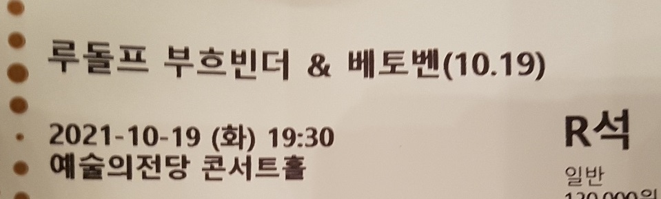

최근 베토벤을 많이 듣는다. 마침 베토벤 리사이틀이 있어 다녀왔다.

연주자는 루돌프 부흐빈더. 녹음만 몇 번 들어본 피아니스트인데, 베토벤 레퍼토리로 유명하다고 한다. 얼마 전 예정돼 있었던 쉬프의 리사이틀과 함께 예매했는데, 쉬프 쪽은 취소됐다. 아쉬움을 뒤로하고 예술의전당을 찾았다.

## 프로그램

프로그램은 베토벤 피아노 소나타. 진부한 곡들이 많았으나 그 나름의 재미가 있었다.

1. 베토벤 피아노 소나타 14번 "월광"
2. 베토벤 피아노 소나타 20번
3. 베토벤 피아노 소나타 8번 "비창"
4. 베토벤 피아노 소나타 10번
5. 베토벤 피아노 소나타 21번 "발트슈타인"
6. 베토벤 피아노 소나타 17번 "템페스트" 3악장 (앙코르)
7. 베토벤 피아노 소나타 18번 "사냥" 2악장 (앙코르)

## 후기

전체적으로 템포가 아주 빨랐다. 설득력은 있었으나 잦은 미스와 뭉개짐 등 템포에 끌려다닌단 느낌이 들었다.

시작인 월광 때 크게 실망했다. 홀 탓인지 연주자의 페달링 탓인지 울림이 심했고, 빠른 템포에 미스와 뭉개짐이 따라왔다. 설상가상으로 내 앞자리에서 분 단위로 기침을 하며 마스크를 자꾸 내려댔다. 기침이 길어지자 연주자도 영향을 받은 듯, 그래도 들을 만했던 연주가 무너졌다. 처음으로 연주회에 괜히 왔단 생각이 들었다.

다행히 점점 연주가 나아졌다. 20번, 8번 2악장, 10번은 좋았다. 지나고 보니 세 곡 다 서정적인 곡에 비교적 부드러운 해석이었다. 난 그게 마음에 들었나 보다.

마지막 발트슈타인 역시 빠른 템포를 가져갔는데, 미스와 뭉개짐은 여전하나 템포에 끌려다닌단 느낌이 덜 해 즐겁게 들었다. 1악장은 아쉬웠지만 괜찮았다. 3악장도 비슷했으나 좀 더 좋았다.

앙코르 두 곡은 최고였다. 사실 본 공연보다 나았던 것 같기도 하다. 강렬한 폭풍과 즐거운 사냥이었다.

박수가 대단했다. 경험해본 박수 중 가장 크고 길었던 것 같다. 좋은 공연이긴 했으나 기립 박수가 수없이 나와 좀 놀랐다. 한국에 부흐빈더 팬이 많은 걸까? 박수가 엄청나니 연주자가 앙코르 전 알겠다, 하겠다는 모션을 보여주는 게 재밌었다. 이후 장난스러운 느낌의 사냥으로 이어지니 여운이 남는 마무리였다.

관크가 너무 심한 공연이기도 했다. 앞쪽에선 엄청나게 기침을 하고, 왼쪽에선 연주 중 프로그램 북을 넘기고, 오른쪽에선 가방을 떨어뜨리고, 뒤쪽에선 전화벨이 울리고... 산만한 공연이었다. 한참을 기침하던 사람은 마스크를 내린 채로 계속 물을 마시더니 경고를 받았다. 인터미션 이후에는 자리를 옮기거나 퇴장했는지 사라졌다.

실망도 했으나 재밌는 공연이었다. 왠지 베토벤은 노년의 연주자가 끌린다. 부흐빈더 옹도 컨디션을 많이 타시는 것 같던데, 오래도록 건강하셔서 좋은 연주를 하시면 좋겠다.

