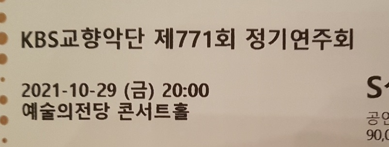

시험이 끝나서 미루던 후기를 쓴다. KBS 정기연주회였다.

마지막으로 들었던 KBS 공연이 만족스러웠던 탓에 4분기 패키지를 결제했다. 이게 첫 공연이었다. 지휘는 얍 판 츠베덴, 프로그램은 베토벤과 프로코피예프의 교향곡.

## 프로그램

둘 다 유명한 곡들이지만 교향곡을 즐겨 듣지 않다 보니 낯설었다.

1. 베토벤 교향곡 5번
2. 프로코피예프 교향곡 5번

## 후기

곡에 대해 잘 모르니 KBS의 연주가 어떠했는지 평가하긴 어렵다. 순전히 느낀 바로는 베토벤은 깔끔했으나 프로코피예프는 아쉬웠다.

베토벤 5번은 깔끔하고 재미있었다. 아주 베토벤스러운 곡이었다. 주제를 끝없이 반복하지만, 그럼에도 지루하지 않은, 흥미로운 변형들이 재밌었다. 악장 구성마저 베토벤다웠다. 2악장의 첼로가 참 마음에 들었다. 앞으로도 베토벤이 듣고 싶어지면 종종 찾아 들을 것 같다.

나는 몰랐지만, 교향곡을 자주 듣는 친구 말론 엄청 빠르게 연주했다고 한다. 그런데도 나는 상당히 정돈됐다고 느꼈는데, 연주를 잘한 것 아닐까?

프로코피예프 5번은 다소 산만했으나 흥미로웠다. 악기 간 음량이나 박자가 잘 안 맞는지 조금 이상했다. 원래 이런 곡이 아닐 것 같은데... 그래도 뒤로 갈수록 좋아진 것 같다. 특히 마무리가 좋았다. 어쨌든 좋은 곡이었다. 후기 프로코피예프 느낌이 물씬 난다. 자주 듣는 신포니아 콘체르탄테와 비슷한 색채라 생각한다.

매력적인 주제가 많이 나온다. 프로코피예프는 참 멜로디를 잘 쓴다는 생각이 들었다. 2악장의 스케르초스러운 멜로디가 아주 중독성 있다. 1악장의 불협화적인 동시에 목가적인 주제도 재밌다. 현이 멋있는 곡이라고 느끼기도 했다. 4악장의 바이올린이 참 멋있더라.

츠베덴은 남자다운 외모에 파워풀한 자세로 지휘했다. 보는 재미가 있는 지휘였다.

곡을 예습하지 않고 가면 불만족스러웠던 적이 많은데, 이번엔 꽤 만족스러운 공연이었다. 패키지의 다음 연주회도 기대해본다.

