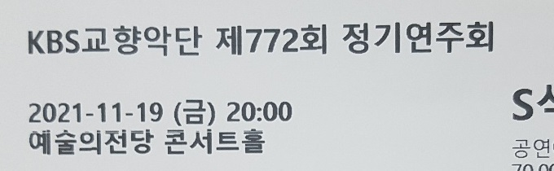

예당에 다녀왔다. KBS 4분기 패키지의 두 번째 공연이었다.

지휘는 크리스토프 에센바흐, 협연자는 알리스 사라 오뜨.

## 프로그램

1. 차이콥스키 <예브게니 오네긴> 중 폴로네이즈
2. 라벨 왼손을 위한 피아노 협주곡
3. 에릭 사티 그노시엔느 1번 (앙코르)
4. 차이콥스키 교향곡 5번

## 후기

꽤 자주 듣는 에센바흐와 유튜브 알고리즘으로 종종 듣는 사라 오뜨의 조합이라 좋은 연주를 기대했다. 최근 KBS 정기연주회들이 만족스러웠기 때문이기도 했다.

차이콥스키 폴로네이즈는 처음 들어봤는데 유명한 곡이란다. 현의 멜로디가 돋보이는 곡이다. 공연의 시작이나 끝으로 적절한 곡이란 생각이 들었다. 연주의 좋고 나쁘고는 잘 모른 채 가볍고 즐겁게 들었다.

라벨 왼피협은 그냥 피협보다도 좋아하는 곡이라 익숙했다. 피아노나 금관의 큰 미스가 몇 번 있었지만 전체적으로 만족스러웠다. 특히 오뜨와 에센바흐의 해석은, 내가 왼피협에 기대했던 것이 아니었음에도, 상당히 좋았다. 아쉬운 점은 피아노와 오케스트라가 같이 연주할 때 피아노의 소리가 아예 안 들린 것. 오뜨가 온몸을 써가며 내리치는데도 잘 안 들렸다.

오뜨가 지병 때문에 왼손에 문제가 생겼었다고 알고 있다. 왼손을 위한 피아노 협주곡을 협연한 건 증상을 이겨내려는 의지 혹은 다 떨쳐냈다는 표명인 것 같다.

오뜨가 앙코르 전에 몇 마디 말을 했는데 하나도 못 알아들었다. 내 영어 실력의 처참함을 다시 느꼈다. 영어 공부를 좀 해야 할 것 같다. 아마 농담을 했는지 관객들이 웃었는데 난 못 웃었다....

앙코르는 사티의 그노시엔느였다. 정말 정말 좋은 선곡이라 생각했다. 라벨과 사티가 동시대 프랑스에서 활동한 인상주의 작곡가란 공통점도 있고, 색채감이 짙은 라벨과 다르게 사티는 미니멀리즘에 가까운 차이점도 있어 재밌게 감상할 수 있었다.

사실 에릭 사티의 곡을 공연장에서 들을 일은 없을 거로 생각했다. 연주 빈도 탓도 있고 돈 주고 듣고 싶지 않은 탓도 있다. 하지만 곡이 단순한 만큼 오히려 연주자의 해석이 잘 와닿는 효과가 있었다. 어둡고 잔잔한, 동시에 명상적인.... 탁월했다.

차이콥스키 교향곡 5번은 그 유명세가 대단하다 보니, 차이콥스키와 교향곡 둘 다 잘 안 듣는데도 불구하고 몇 번 들어봤다. 그래도 취향에 잘 안 맞는지 좀 졸렸다. 그러다가 2악장 중후반 선율이 좋아서 잠이 확 깼다. 애상적인 주제였다. 역시 차이콥스키는 멜로디인가.

곡에 대해 잘 알지 못했음에도 눈에 띄는 실수가 많았다. 특히 박자 문제가 심했다. 누가 들어도 유니즌인데 박자가 안 맞는 등.

재밌는 건 3악장에서 가장 실수가 적다고 느꼈지만 가장 재미가 없었다. 솔직히 말해서 왈츠 악장 자체가 너무 뜬금 없다. 2악장이 가장 마음에 들었고, 4악장도 볼륨 덕에 흔히 말하는 '뽕'이 있었다.

특이한 관크를 당했다. 숨소리 관크였다.

KBS교향악단 연주회를 자주 다녔더니 단원들 얼굴이 좀 익는다.

저번 공연(KBS 771회)에서 들리지 않아 아쉬웠던 하프 소리를 원없이 들은 것 같다.

황홀함이나 완벽함은 없었어도 좋은 연주였다는 생각이다. 12월 합창이 기대된다.

