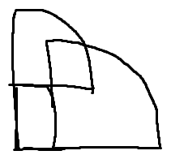

두 번째로 ICPC에 참여했다. 작년이랑 똑같은 성적을 거두었다. 아쉬움이 크다.

PS 실력이 좋아진 건 확실한데, CP 실력은 별개인가보다.

후기와 함께 대회 중에 풀었거나 업솔빙한 문제를 적는다.

## 후기

이상하게 작년보다 힘들었다.

잠도 푹 자고 아침도 먹고서 치렀는데 뭐가 문제였을까? 머릿속에서 풀이를 생각하고도 코드로 옮기질 못했다. 아마 작년과는 다르게 잘하고 싶다는 생각에 부담이 생긴 것 같다.

두 가지 개선점을 생각해봤다.

### CP

CP는 어려운 문제를 잘 푸는 게 우선이 아니다. 쉬운 문제를 빠르고 정확하게 푸는 것도 중요하다. 문제를 빠르게 읽는 것이나 난이도를 파악하는 것도 아주 중요하다.

[E번 Histogram](https://www.acmicpc.net/problem/23242)을 풀면서 이 부분이 미흡하다는 걸 느꼈다. 쓸데없이 긴 영어 지문이 정신을 흩트려 꽤 시간이 걸렸다.

이런 일은 CP를 하면서 자주 있다. 난이도 파악을 잘못하는 일은 허다하고, 긴 지문의 영어 문제는 읽기도 벅차다. 간단한 구현에 20분씩 걸리기도 한다. 제한 시간이 있는 CP에서 치명적이다.

이건 시뮬레이션 문제를 빠르게 푸는 연습이 도움 될 것 같다.

결론적으로 코드포스를 열심히 해야겠단 생각이 든다.

### 1PC

ICPC는 3명이 PC 1대로 대회를 진행한다. 우리 팀은 이게 숙련되지 않아서 3명이 다 같이 1문제씩 푸는 느낌이었다. 다른 사람의 컴퓨터로 낯선 장소에서 코딩을 하는 게 꽤 힘든 일인 것 같다. 대회 전에 팀원이 모여 적당한 대회 셋을 1PC로 풀어볼 필요가 있겠다.

또 컴퓨터를 잡지 않았을 때 역할도 연습해야겠다고 느낀다. 항상 구현할 때 IDE를 붙잡고 하다 보니 몰랐는데, 종이와 펜만 잡고 수도코드를 생각하는 게 꽤 어려운 일이었다.

대회 중 팀원이 PC를 잡고 [H번 Similarity](https://www.acmicpc.net/problem/23245)를 푸는 동안 나는 [B번 당근 밭](https://www.acmicpc.net/problem/23239)을 풀려고 했었다. 문제를 추상화하고 풀이까지 마쳤는데 생각을 수도코드로 옮기는 게 힘들었다. IDE 없이 손으로 코드를 쓰는 게 매우 어렵더라. 심지어 B번은 case work 문제였다. 결국 PC에 자리가 났을 때 코드를 처음부터 써야 했고, 구현을 마치지 못한 채 대회가 끝났다.

문제 풀이 후에 바로 코드를 작성하지 말고 먼저 수도코드를 생각해보는 연습을 해봐야겠다.

## 문제

짧게 아이디어만 적는다.

### A. Best Student

[백준 23238번](https://www.acmicpc.net/problem/23238)

Mo's 연습문제인 [백준 13548번](https://www.acmicpc.net/problem/13548)과 매우 유사하다.

하지만 빈도가 아니라 값을 구해야 한다. 좌표 압축과 set을 쓰면 $O(Q+N\sqrt{N}\log{N})$인데 TLE를 받는다. set 대신 sqrt decomposition을 써서 업데이트에 $O(1)$, 검색에 $O(\sqrt{N})$ 걸리도록 하면 통과한다. $O(Q+N\sqrt{N})$으로 구할 수 있다.

### B. 당근 밭

[백준 23239번](https://www.acmicpc.net/problem/23239)

제1 사분면을 제외하면 원 안의 점 개수 구하기다. 이분 탐색으로 $O(N\log{N})$으로 구할 수 있다.

$L<w+h$일 땐 제1 사분면도 사분원으로 구하면 된다.

$L>w+h$일 때 위 그림처럼 사분원이 겹쳐버려서 구하기 까다롭다.

포함 배제의 원리로 구하는 법은 모르겠다. 그냥 두 원의 높이에 max해서 직접 구했다.

### E. Histogram

[백준 23242번](https://www.acmicpc.net/problem/23242)

(최대 인덱스, 버킷 수)를 state로 DP를 돌린다.

$V[X]=E[X^2]- E[X]^2$를 이용해 $O(1)$으로 Variance를 구하면 $O(BN^2)$이다.

### H. Similarity

[백준 23245번](https://www.acmicpc.net/problem/23245)

세그먼트 트리를 사용한 스위핑이다. 어떻게 스위핑하든 $O(N\log{N})$이면 된다.

나는 $p_i$에 대해서 오름차순, $q_i$에 대해선 내림차순으로 정렬해 두 번 순회했다.

처음 펜윅 트리에 모든 $q_i$를 넣어놓고 순회할 때마다 빼내면 $p_i<p_j$이면서 $q_i<q_j$인 $(i, j)$의 개수를 구할 수 있다. 이걸 한 번 더 반복해 $(i,j,k)$의 개수를 구했다.

### I. Sport Climbing Combined

[백준 23246번](https://www.acmicpc.net/problem/23246)

그냥 `tuple<int, int, int> x = { p*q*r, p+q+r, b }`을 정렬하면 풀린다.

### J. Ten

[백준 23247번](https://www.acmicpc.net/problem/23247)

prefix sum과 투 포인터로 $O(N^3)$로 풀었다.

그런데 $p_{ij}>0$이라 subsection의 크기가 10 이하인 것만 보면 되므로 브루트포스도 가능하다.

### K. Treasure Hunter

[백준 23248번](https://www.acmicpc.net/problem/23248)

뒤에서부터 본다면, 자신의 위치에서 갈 수 있는 보물을 1개씩 뺄 때 최적이 보장된다.

$O(N\log{N})$ 스위핑이다. set으로 풀었다.

### Others

지금까지 푼 문제만 작성했다. 문제를 더 풀면 이 글에 추가할지도 모르겠다.

C번은 너무 풀기 싫게 생겨서, 아마 A번이나 L번을 풀어볼 것 같다.

*2021-10-16 A번 추가*
