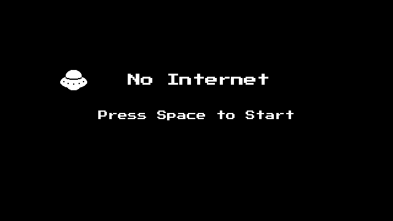
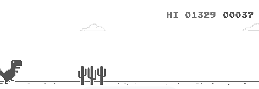
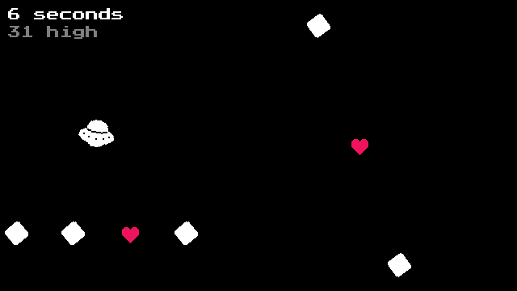
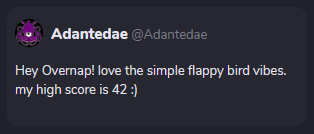

Opera GX 게임잼에 참가했다. 하루 동안 간단한 게임을 만들었다.

[여기](https://gamejolt.com/games/jumpingufo/638575)에서 웹으로 플레이할 수 있다.

## 게임 컨셉

게임잼 주제가 독특했다. Opera GX 브라우저의 'No Internet' 페이지에 들어갈 게임을 만드는 거였다. 또 브라우저 로고가 UFO인지 UFO 테마 게임을 만들란다.

간단한 아케이드가 좋을 것 같았다. 내 편견일지 모르겠지만, 고작 인터넷 연결을 기다리는데 너무 복잡한 게임은 별로다. 이스터에그 내지는 심심풀이 미니게임에 과도한 리소스가 투입되면 낭비란 생각도 있다.

크로미움의 공룡 게임은 훌륭한 선례다. 간단한 룰에 없다시피 한 리소스가 'No Internet' 페이지에 아주 알맞다. 또 생각난 건 곰플레이어의 이스터에그 게임 닷지와 게임 VVVVVV 속 미니게임 Super Gravitron. 셋 다 무언갈 피하는 게임이다.

피하는 게임은 직관적이고 중독성 있다. UFO로 뭔가 피하는 것도 꽤 어울릴 것 같았다. 그대로 밀고 나가 한나절 동안 작업했다.

## 후기

완성된 게임은 게임잼 작업물이 으레 그렇듯 어딘가 엉성했지만, 꽤 마음에 들었다. 직접 플레이해도 꽤 재미있었다. 다만 UFO라는 주제를 살리지 못한 것 같아 아쉬웠다. 탄막 스프라이트를 운석으로 하고 싶었는데 그림 그리는 재주가 없어 포기했다. 어쨌든 배경이 검으니 우주라고 우길 수야 있겠다.

제출한 지 몇 분 안 되어 올라온 댓글이 플래피 버드 느낌이라 해서 당황했다. 수직적인 패턴과 정사각형 탄막 때문에 VVVVVV 느낌이 강하다고 생각했는데, 다른 사람들이 느끼기엔 플래피 버드 같나보다. 적당히 원버튼 점프 조작을 넣었는데 그 시초가 플래피 버드인가?

툴 제한 덕분에 오랜만에 게임메이커를 만져봤다. 옛날에 다뤄본 적 있는 엔진이다. 5년쯤 됐다 보니 낯설어서 적응하는 데 꽤 걸렸다. 툴 제한 게임잼이라 신선했다. 오페라가 게임메이커 제작사를 인수했다던데 그 영향인가보다.

간만에 게임 개발을 하니 즐거웠다. 게임 개발에 대한 열정이 사라졌다고 생각했는데 막상 해보니 재밌었다. 한동안 웹과 알고리즘만 해서 더 그랬다.

다른 사람의 게임을 보는 것도 재미있었다. 이번 게임잼에선 [이 게임](https://gamejolt.com/games/uddermayhem/637743)이 정말 잘 만들었다. 스프라이트도 잘 만들었고 사운드도 좋다. 특히 조작 피드백이 인상적이다. 통통 튀는 피드백이 쫄깃한 조작감을 준다. 게임 룰은 단순한데 조작만 해도 재미있다. 역시 게임은 조작감이 좋아야 한다.

이번이 두 번째 게임잼 참여다. 종종 참여하면 좋을 것 같다. 짧은 시간 동안 게임을 완성하는 건 독특한 경험이다. 긴 시간 유니티를 붙잡고 있는 것과는 또 다르다. 개발 루틴에 환기도 하고, 게임성에 대해 고민도 해볼 수 있다.

